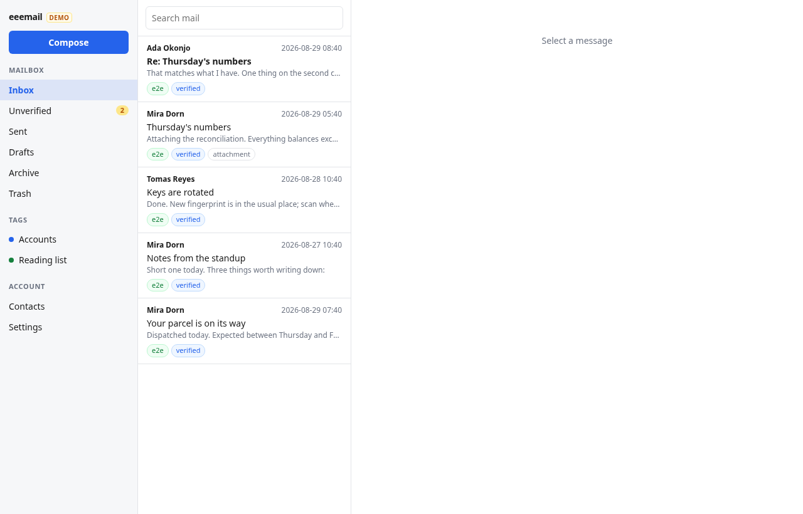
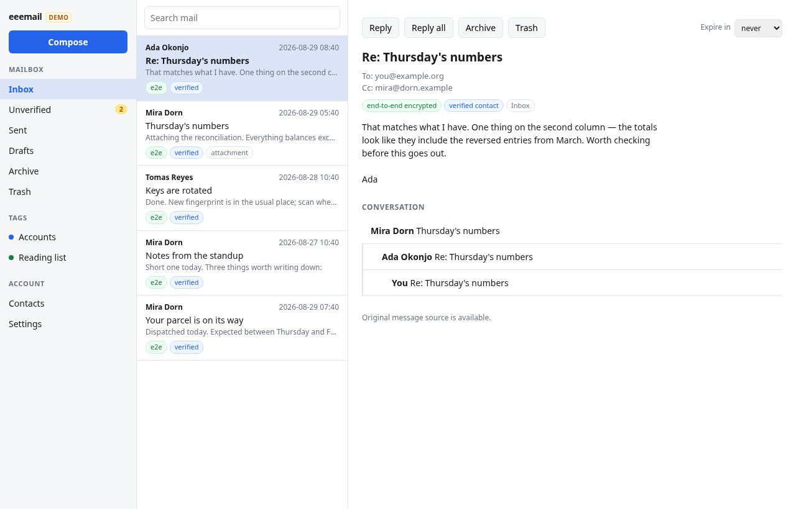
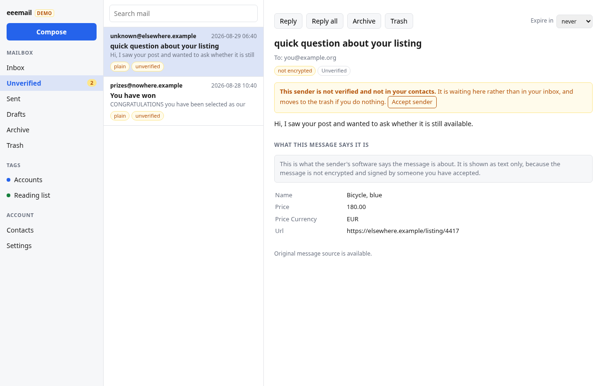
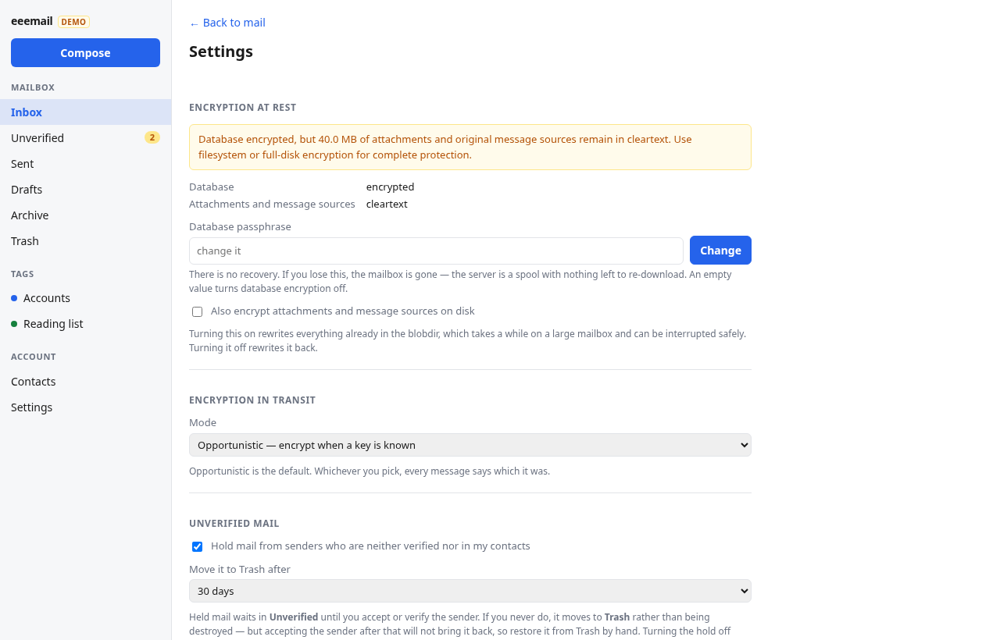

# eeemail

An end-to-end encrypted email client with classic email functionality.

Delta Chat solved the hard parts of usable email encryption — Autocrypt key
exchange, QR-code contact verification that resists active MITM attacks,
ephemeral messages, multi-device sync — but presents them as a chat client, and
upstream has no interest in a traditional email interface.

eeemail keeps the encryption engine and builds the email client: subjects,
CC/BCC, threads, attachments, search, drafts and tags.

> **How this was built.** Most of the code and documentation here was written by
> a large language model working under human direction — "vibe coded", if you
> like. It is reviewed, it is tested, and the tests pass; it has **not** been
> audited by a security professional, and an encrypted mail client is exactly
> the kind of software where that distinction matters. Read it before you trust
> it, and do not rely on it for anything consequential yet.

## What it looks like

| | |
|---|---|
|  |  |
| **Inbox.** System tags on the left, mail in the middle, encryption state on every row. | **Reading.** Thread, recipients, and what the encryption actually was. |
|  |  |
| **Unverified.** Mail from senders you have not accepted, with 30 days to change your mind. | **Settings.** The at-rest panel says what is *not* protected, not just what is. |

More in [`screenshots/`](screenshots/). These are rendered from fixture data by
[`scripts/screenshots.sh`](scripts/screenshots.sh) — never from a real mailbox —
so they regenerate identically and a change in the images is a change in the UI.

## Install

Grab an installer from the [releases page](https://github.com/Yjlion/eeemail/releases):
a `.deb` or `.AppImage` on Linux, an installer on Windows. The `.deb` and the
Windows installer put eeemail in your applications menu.

```sh
sha256sum -c eeemail_0.3.0_amd64.deb.sha256   # verify first
sudo apt install ./eeemail_0.3.0_amd64.deb
```

**[`docs/INSTALL.md`](docs/INSTALL.md)** is the full guide: verifying the
download, first launch, why a dedicated account is recommended and how to share
one anyway, where your mail is stored, the retention deadlines, and the two
command-line tools in the separate archive. Nothing is code-signed, so the
checksum is the only integrity check there is.

macOS is not built yet.

## How it works

IMAP and SMTP are used as **transport only**, not storage. A single IMAP folder
is watched; messages are downloaded, decrypted, stored locally and removed from
the server. Decrypted content is never written back. The local database is the
mailbox.

Encryption is opportunistic by default — encrypted whenever the recipient's key
is known, cleartext otherwise, clearly marked either way — and can be set
stricter (E2E only) or more lenient.

**There are no folders.** Most people do not want to file mail, so the mailbox
organizes itself: Inbox, Sent, Drafts, Archive, Trash and Unverified are system
tags derived from what a message *is*, and users add their own tags on top. A
message can carry several. See [ADR 0017](docs/adr/0017-system-tags.md).

**Mail from strangers does not reach the inbox.** A sender who is neither
verified nor in your address book lands in **Unverified**, where it waits for
you to accept or verify them — 30 days by default, configurable — and is then
moved to Trash. See [ADR 0018](docs/adr/0018-contact-gating.md).

**Exactly one thing deletes mail on a timer, and it is Trash.** Unverified mail
that was never accepted, a message whose disappearing-message timer fired, and
anything you throw away all arrive in Trash first and leave on one deadline you
can set. See [ADR 0019](docs/adr/0019-recoverable-ephemeral-expiry.md).

## Status

**v0.3.0 is the first release you install rather than extract.** The engine is
complete through Phase 14, the desktop client reads and writes, and the whole
thing has been run end to end against a real mail server, against Delta Chat's
own engine, and against GnuPG.
`core/` is a fork of
[`chatmail/core`](https://github.com/chatmail/core) at `v2.59.0`, vendored via
`git subtree`, with eeemail's own code confined to `core/src/email/`.

| Area | State |
|---|---|
| Raw MIME retention with configurable expiry | ✅ |
| Per-message To/Cc/Bcc recipient sets, Cc/Bcc on the wire | ✅ |
| Conversation threading over `References`/`In-Reply-To` | ✅ |
| Tags, archive, search, device sync | ✅ |
| Encryption policy: strict / opportunistic / lenient, per-contact | ✅ |
| Server retention: delete-after-download / keep N days / never | ✅ |
| Read-receipt policy, per-contact overrides | ✅ |
| Encrypted backup with staleness tracking | ✅ |
| JSON-RPC API and headless CLI | ✅ |
| Desktop reading client (Tauri) | ✅ |
| System tags, contact gating, recoverable ephemeral expiry | ✅ |
| Composer, account setup, contacts and QR in the GUI | ✅ |
| Blobdir encryption at rest | ✅ |
| Screenshots rendered from fixtures | ✅ |
| End-to-end pass against a live server | ✅ |
| Structured email ([SML](https://structured.email/)) | ✅ |
| Installers with a launcher entry (`.deb`, `.AppImage`, Windows) | ✅ |
| First-launch disclosure of what this software is | ✅ |
| macOS build | ❌ |
| Code signing | ❌ |
| Interop with Thunderbird, Gmail or any mainstream provider | ❌ |

Inherited from `chatmail/core` and interop-tested upstream: Autocrypt,
SecureJoin QR verification, PGP/MIME, protected headers, multi-device sync.

**Known gaps, stated plainly.** Encryption bootstraps from the `Autocrypt:`
header a correspondent advertises, which is unauthenticated: it protects against
someone reading stored mail, not against someone rewriting mail in flight. That
is Autocrypt's own threat model, and it is why "encrypted" and "verified" are
two separate badges — only a QR verification survives an active attacker. See
[ADR 0021](docs/adr/0021-autocrypt-key-contacts.md), which reverses an upstream
`v2.59` decision and explains what that costs. Blob encryption is real but
opt-in, and requires
a database passphrase; until you set one, attachments and retained message
sources stay cleartext in the blobdir, and the app says so rather than claiming
otherwise. Encrypted mail can silently omit a recipient whose key is missing;
eeemail records who and can tell you. Autocrypt, SecureJoin and outbound
classic email are interop-tested against Delta Chat's own engine by
[`scripts/interop-pass.py`](scripts/interop-pass.py); nothing has been tested
against Thunderbird, Gmail or any mainstream provider.
See the [open issues](https://github.com/Yjlion/eeemail/issues).

## Documentation

- [`docs/DESIGN.md`](docs/DESIGN.md) — full design and phased implementation plan
- [`docs/adr/`](docs/adr/) — architecture decision records
- [`docs/handoff.md`](docs/handoff.md) — current state, gaps, and what to do next
- [`docs/development.md`](docs/development.md) — build and fork workflow
- [`docs/testing.md`](docs/testing.md) — why the suite needs `cargo nextest`
- [`docs/out-of-scope.md`](docs/out-of-scope.md) — upstream features slated for removal
- [`server/`](server/) — a Postfix/Dovecot test server to develop against

## License

[MPL-2.0](LICENSE). See [`NOTICE`](NOTICE) for bundled dependencies.
